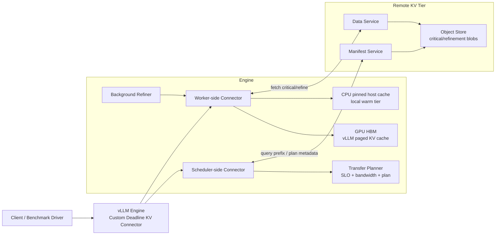

# Deadline-Aware Prefix KV over Remote/Cold Tier for vLLM

> 目标：实现一个**可直接接入 vLLM、可以真实跑推理、可以从远端/冷层加载 prefix KV、并支持 deadline-aware 分级传输**的最小可运行系统。  
> 用途：把这个文档直接喂给 vibe coding，让它按模块和文件落地实现。

---

## 1. 系统目标

本项目实现一个面向 **远端/冷层 prefix KV** 的 vLLM 扩展系统。系统在共享前缀命中时，不再总是“把完整 fp16 KV 一次性传完再开始 decode”，而是改为：

1. 先在 **TTFT deadline** 前传输“可用的最小 KV 子集”，让模型尽快出首 token；
2. 再在后续 decode 过程中，后台补齐更高精度的 refinement 数据；
3. 若网络条件太差或远端加载失败，则自动降级到 **recompute**；
4. 支持单机 4×V100 环境，远端 KV store 可以先用**本机另一个进程 + netns/veth/tc** 模拟。

这个系统的第一版不是做“最强压缩器”，而是做一个**协议 + 调度 + vLLM 接口打通**的可运行原型。

---

## 2. 第一版的范围边界

### 2.1 第一版必须做

- 真实接入 vLLM；
- 真实保存/加载 prefix KV；
- 支持远端 KV store；
- 支持两级传输：
  - **critical tier**：保证 TTFT 的关键数据；
  - **refinement tier**：首 token 之后再补；
- 支持 deadline-aware 传输计划；
- 支持 T0/T1/T2 三层：
  - T0: GPU HBM；
  - T1: CPU pinned memory；
  - T2: remote KV store；
- 支持网络条件注入：带宽、RTT、loss；
- 支持基础指标采集：TTFT / TPOT / throughput / P95 / goodput / bytes。

### 2.2 第一版不要做得太重

- 不做真正复杂的 learned importance predictor；
- 不做 QUIC 内核级部分可靠性；
- 不做分布式多节点一致性协议；
- 不做全局 router / multi-tenant fairness；
- 不做复杂的 GPU kernel 改写；
- 不强依赖 RDMA / NIXL。

### 2.3 第一版的关键收缩

第一版里，**critical 与 refinement 的区别主要体现在“精度层级”而不是“缺失一部分层”**。

也就是：

- critical：**全部已命中 prefix blocks 的低精度版本**，保证模型立刻能用；
- refinement：**这些 blocks 的高精度残差或更高精度覆盖版本**，后续补上。

这样做的原因很简单：

- 如果只传一部分层，模型通常没法稳定工作；
- 如果对所有层都先传低精度版本，模型可以先跑起来；
- 后续再把相同 block 的高精度内容覆盖/修正，更容易做成系统原型。

---

## 3. 推荐实现策略

### 3.1 最小可运行策略

第一版采用下面这个协议语义：

- **命中 prefix KV 时**：
  - critical channel 先发送 `int8` 量化后的 prefix KV blocks；
  - worker 端将其反量化并写入 vLLM paged KV cache；
  - decode 开始，尽快产出第一个 token；
  - refinement channel 后续发送：
    - 方案 A：fp16 residual；或
    - 方案 B：完整 fp16 overwrite；
  - 在后续 decode step 之前，把 refinement 应用到 paged KV cache。

### 3.2 推荐优先顺序

第一版请按下面顺序做：

1. **完整 fp16 远端 load/store 跑通**；
2. 加入 `int8 critical + fp16 overwrite refinement`；
3. 加入 deadline-aware planner；
4. 加入 T1 pinned host cache；
5. 再做 residual refinement；
6. 最后再考虑 int4 / 更复杂的部分可靠性。

也就是说，第一版最先追求的是：

> 先让 vLLM + 远端 KV + prefix hit + load/store 跑通；再逐步升级成 deadline-aware 分级传输系统。

---

## 4. 与 vLLM 的对接方式

### 4.1 对接原则

本项目优先采用 **vLLM V1 的 KV connector 机制**，尽量不 fork 大片 vLLM 核心逻辑，只在必要时加最小 patch。

### 4.2 本项目依赖的 vLLM 能力

本系统依赖 vLLM 当前已经公开的 KV transfer / disaggregated prefill / connector 机制，尤其是：

- `KVTransferConfig`；
- `kv_connector_module_path` 动态加载自定义 connector；
- `kv_role = kv_producer / kv_consumer / kv_both`；
- `kv_load_failure_policy = recompute / fail`；
- `KVConnectorBase_V1` 的 scheduler-side 与 worker-side接口；
- `prefer_cross_layer_blocks()` 对跨层 block 布局的偏好。

### 4.3 目标 API 面

我们的自定义 connector 直接继承 `KVConnectorBase_V1`，最核心要实现这些接口：

#### Scheduler-side

- `get_num_new_matched_tokens(request, num_computed_tokens)`
- `update_state_after_alloc(...)`
- `update_connector_output(...)`
- `request_finished(...)`
- `take_events()`

#### Worker-side

- `start_load_kv(forward_context, **kwargs)`
- `wait_for_layer_load(layer_name)`
- `save_kv_layer(layer_name, kv_layer, attn_metadata, **kwargs)`
- `wait_for_save()`
- `build_connector_worker_meta(...)`
- `get_finished()`

### 4.4 实现策略说明

第一版建议把 connector 实现成 **单个 connector class + 内部分 scheduler adapter / worker adapter** 的结构，而不是一开始拆成多个继承层级。

### 4.5 是否需要 patch vLLM

默认目标：**不 patch 或只 patch 极少数文件**。

允许的最小 patch：

1. 暴露更多 debug/metric hook；
2. 在某些阶段更容易拿到 request id / prefix hash / matched block ids；
3. 为 refinement 应用增加更稳妥的“下一 decode step 前更新”钩子；
4. 当 `prefer_cross_layer_blocks = True` 时，验证当前 attention backend 下的布局是否满足预期。

如果不 patch 就能做，请优先不 patch。

---

## 5. 系统总架构



---

## 6. 核心设计决策

## 6.1 三层存储

### T0: GPU HBM

- 真实运行中的 vLLM paged KV cache；
- 所有 decode 都最终从这里读；
- connector 的 load/store 最终都要落到这里。

### T1: CPU pinned host cache

- 保存最近命中的 critical blobs 或已反量化 staging buffer；
- 作用：
  - 避免重复走网络；
  - 作为 host-device copy 的 staging 区；
  - 为 refinement 提供中间缓存。

### T2: remote KV store

- 保存 prefix KV 对象；
- 第一版用本机 sidecar 进程模拟；
- 通过 netns + veth + tc 注入网络条件；
- 逻辑上当作“远端/冷层”。

## 6.2 Prefix 粒度

第一版统一按 **vLLM block 粒度** 管理对象，而不是按 token 单独拆分。

原因：

- 与 paged KV cache 对齐；
- load/store 更容易映射到 slot/block；
- 更适合跨层统一布局；
- 易于实现 bytes accounting 与传输计划。

## 6.3 对象命名

每个 prefix KV 对象用下面的 key 唯一标识：

```text
prefix_key = hash(
  model_id,
  tokenizer_id,
  kv_layout_version,
  cache_dtype,
  block_size,
  prompt_token_ids[:matched_prefix_len],
  mm_hashes(optional)
)
```

### 额外要求

- `model_id` 和 `kv_layout_version` 必须进入 key；
- 不同 vLLM / connector 版本如果布局变了，必须 bump `kv_layout_version`；
- 不允许不同布局共享对象。

## 6.4 数据平面分层

每个 prefix object 包含：

1. `manifest`：对象元数据；
2. `critical blob`：首 token 前必须加载的数据；
3. `refinement blob`：首 token 后补的数据。

### 第一版推荐格式

- `critical blob`:
  - codec: `int8_symm`
  - scope: 全部命中 prefix blocks
- `refinement blob`:
  - codec: `fp16_overwrite`
  - scope: 与 critical 同一批 blocks

第二版再升级成：

- `refinement blob = fp16_residual`
- 或 `refinement blob = int4_residual + fp16 fallback`

---

## 7. 请求执行流程

## 7.1 Prefix miss

1. request 进入 vLLM；
2. scheduler connector 查询 manifest，未命中；
3. vLLM 正常 prefill 计算；
4. worker connector 在 `save_kv_layer()` 中把新生成的 prefix KV 导出；
5. 导出后异步上传到 remote KV store；
6. 当前请求继续正常 decode。

## 7.2 Prefix hit

1. request 进入 vLLM；
2. scheduler connector 查询 manifest；
3. 根据网络估计与 `TTFT_SLO` 生成 transport plan；
4. `get_num_new_matched_tokens()` 返回可加载 token 数；
5. worker connector 在 `start_load_kv()` 开始 critical load；
6. `wait_for_layer_load()` 确保当前层的 critical KV 就绪；
7. 模型执行并产出首 token；
8. background refiner 下载 refinement blob；
9. 在后续 decode step 前，把 refinement 应用到 paged KV cache；
10. 请求结束后，connector 汇报统计信息。

## 7.3 Load failure / deadline miss

- 若 manifest 命中但 critical load 失败：
  - 按配置执行：
    - `recompute`：重新走 prefill；
    - `fail`：直接报错。
- 若 refinement 超时：
  - 直接丢弃 refinement；
  - 当前请求继续用 critical 版本完成；
  - 记录 degraded 标记。

---

## 8. Deadline-aware planner

## 8.1 目标

给定：

- `TTFT_SLO_ms`
- 当前估计带宽 `bw_est`
- RTT `rtt_est`
- prefix blocks 数量
- critical/refinement bytes
- 当前队列长度 / 并发

输出一个传输计划：

```python
class TransferPlan:
    plan_id: str
    matched_tokens: int
    matched_blocks: list[int]
    mode: Literal[
        "FULL_FP16",
        "CRITICAL_INT8_ONLY",
        "CRITICAL_INT8_THEN_FP16",
        "RECOMPUTE"
    ]
    critical_deadline_ms: int
    refine_budget_ms: int
    load_from_tier: Literal["T1", "T2"]
    allow_refine_drop: bool
```

## 8.2 第一版决策规则

不要一上来搞复杂控制器，先做一个稳的 rule-based planner：

### 模式 1: FULL_FP16

如果预计：

```text
rtt + fp16_bytes / bw_est < TTFT_budget * alpha
```

则直接传完整 fp16。

### 模式 2: CRITICAL_INT8_THEN_FP16

如果完整 fp16 赶不上 deadline，但 int8 critical 能赶上，则：

- 首先传 int8 critical；
- TTFT 之后后台补 fp16 overwrite。

### 模式 3: CRITICAL_INT8_ONLY

如果网络很差，连 refinement 也不值得补，则：

- 只传 critical；
- 不做 refinement；
- 记录质量降级标签。

### 模式 4: RECOMPUTE

如果：

- 远端 KV 不可用；
- 或命中 prefix 太短；
- 或预估 load 成本高于 recompute；

则直接 recompute。

## 8.3 planner 实现要求

- 维护 EWMA 带宽估计；
- 按 prefix_key 记录最近成功/失败历史；
- 记录每次计划的 `reason code`，便于实验分析。

### reason code 示例

- `full_fp16_within_budget`
- `fallback_to_int8_for_ttft`
- `refine_dropped_due_to_slack`
- `recompute_due_to_short_prefix`
- `recompute_due_to_store_timeout`

---

## 9. Manifest 与对象模型

## 9.1 Manifest 结构

```python
@dataclass
class PrefixManifest:
    prefix_key: str
    model_id: str
    tokenizer_id: str
    kv_layout_version: str
    block_size: int
    cache_dtype: str
    matched_tokens: int
    matched_blocks: list[int]
    num_layers: int
    created_at_ms: int
    last_access_ms: int
    ttl_s: int
    critical_codec: str
    critical_nbytes: int
    critical_object_id: str
    refinement_codec: str | None
    refinement_nbytes: int | None
    refinement_object_id: str | None
    quality_mode: Literal["fp16", "int8+fp16", "int8_only"]
    checksum: str
```

## 9.2 Manifest service API

控制面统一走 HTTP/JSON。

### 必做接口

- `POST /manifest/query`
- `POST /manifest/put`
- `POST /manifest/touch`
- `POST /manifest/delete`
- `GET /manifest/stats`

### query 请求

```json
{
  "prefix_key": "...",
  "request_id": "...",
  "need_refinement": true
}
```

### query 返回

```json
{
  "hit": true,
  "manifest": { ... },
  "tier": "T2"
}
```

## 9.3 Object store API

数据面不走 HTTP，统一走 length-prefixed binary TCP。

### 必做操作

- `GET_CRITICAL(object_id)`
- `GET_REFINEMENT(object_id)`
- `PUT_CRITICAL(object_id, bytes)`
- `PUT_REFINEMENT(object_id, bytes)`
- `DELETE(object_id)`

### 第一版传输语义

- critical：必须完整成功，否则此次 remote hit 视为失败；
- refinement：允许晚到即丢，允许用户态取消，不要求严格可靠重传。

注意：

> 第一版所谓“部分可靠性”是**应用层的迟到丢弃与低优先级补传**，不是内核态 UDP/QUIC 真正不可靠协议。

这已经足够支撑论文原型。

---

## 10. 编码与解码设计

## 10.1 编码接口

```python
class KVCodec(Protocol):
    name: str

    def encode(self, tensor: torch.Tensor) -> EncodedBlob:
        ...

    def decode_to(self, blob: EncodedBlob, dst: torch.Tensor) -> None:
        ...
```

## 10.2 第一版必须实现的 codec

### `FP16RawCodec`

- 输入：fp16 tensor
- 输出：原始 fp16 bytes
- 用途：baseline / overwrite refinement / correctness check

### `Int8SymmetricCodec`

- 输入：fp16 tensor
- 输出：
  - int8 values
  - scale（per-tensor 或 per-block）
- 用途：critical blob

### 第二版可选

- `FP16ResidualCodec`
- `Int4ResidualCodec`

## 10.3 第一版编码粒度

第一版按 **block × layer** 编码。

不要一开始做更细的 token 级编码。

## 10.4 推荐存储布局

第一版推荐统一为：

```text
[prefix object]
  -> [layer 0 block 0..N]
  -> [layer 1 block 0..N]
  -> ...
```

如果 vLLM 当前布局支持跨层连续 block，则优先利用；如果不稳定，则回退到逐层保存。

## 10.5 覆盖式 refinement

第一版 refinement 优先实现为 `fp16 overwrite`：

- 先把 int8 critical 解码写入 paged KV；
- refinement 到来后，用 fp16 版本覆盖对应 block；
- 这样逻辑最简单，正确性最好验证。

等覆盖式版本稳定后，再升级成 residual add。

---

## 11. Connector 内部状态机

## 11.1 Scheduler-side state

```python
@dataclass
class RequestTransferState:
    request_id: str
    prefix_key: str | None
    matched_tokens: int
    matched_blocks: list[int]
    plan: TransferPlan | None
    status: Literal[
        "INIT",
        "MISS",
        "HIT_PLANNED",
        "CRITICAL_LOADING",
        "CRITICAL_READY",
        "REFINING",
        "DONE",
        "FAILED",
        "RECOMPUTE"
    ]
    last_error: str | None
```

## 11.2 Worker-side state

```python
@dataclass
class WorkerLoadTask:
    request_id: str
    layer_name: str
    block_ids: list[int]
    critical_future: Future | None
    refine_future: Future | None
    critical_ready: bool
    refine_ready: bool
    applied_refine_version: int
```

## 11.3 状态要求

- scheduler 侧负责“查找 + 计划”；
- worker 侧负责“取数据 + 解码 + 写入”；
- 任何跨线程共享对象都要有锁；
- 任何状态转移都要有 metrics / logs。

---

## 12. Refinement 机制

## 12.1 第一版的安全实现

不要在任意时刻异步乱写 GPU paged KV。

第一版采用更稳的方式：

1. critical load 完成后，当前 forward 正常执行；
2. refinement 在后台下载到 host buffer；
3. 在**下一次 decode forward 开始之前**，检查该 request 是否有 pending refinement；
4. 若有，则先把 refinement 应用到 paged KV cache，再执行下一步 decode。

## 12.2 好处

- 避免与正在执行的 attention kernel 竞争；
- 不需要复杂 stream/event 协调；
- 更容易保证正确性与可调试性。

## 12.3 Refinement policy

第一版策略：

- 每个 request 最多 refinement 一次；
- refinement 超过 budget 就丢弃；
- refinement 不影响请求活性，只影响质量。

---

## 13. 失败回退策略

## 13.1 回退优先级

1. T1 命中：直接从 host cache load；
2. T2 critical 成功：remote hit；
3. T2 critical 失败：recompute；
4. refinement 失败：忽略 refinement，继续 decode。

## 13.2 失败分类

必须区分：

- manifest miss
- object missing
- checksum mismatch
- decode error
- network timeout
- deadline miss
- connector internal exception

## 13.3 vLLM failure policy 映射

- 默认配置建议：`kv_load_failure_policy = recompute`
- debug 模式：可设为 `fail`

---

## 14. 文件级实现规划

下面是建议的仓库结构。请严格按这个结构实现。

```text
project_root/
├── README.md
├── pyproject.toml
├── requirements.txt
├── configs/
│   ├── deadline_kv_local.yaml
│   ├── deadline_kv_netem_1g_20ms.yaml
│   └── deadline_kv_netem_100m_50ms_loss.yaml
├── scripts/
│   ├── run_kv_store.py
│   ├── run_vllm_server.sh
│   ├── run_bench.py
│   ├── netns_setup.sh
│   ├── netns_teardown.sh
│   ├── tc_profile_1g_20ms.sh
│   ├── tc_profile_100m_50ms_loss1.sh
│   └── smoke_test.sh
├── src/
│   └── dakv/
│       ├── __init__.py
│       ├── config.py
│       ├── logging.py
│       ├── constants.py
│       ├── common/
│       │   ├── __init__.py
│       │   ├── types.py
│       │   ├── hashing.py
│       │   ├── time_utils.py
│       │   ├── checksum.py
│       │   └── tensor_io.py
│       ├── planner/
│       │   ├── __init__.py
│       │   ├── estimator.py
│       │   ├── deadline_planner.py
│       │   └── policies.py
│       ├── codec/
│       │   ├── __init__.py
│       │   ├── base.py
│       │   ├── fp16_raw.py
│       │   ├── int8_symm.py
│       │   └── registry.py
│       ├── store/
│       │   ├── __init__.py
│       │   ├── manifest_models.py
│       │   ├── manifest_service.py
│       │   ├── object_store.py
│       │   ├── local_disk_backend.py
│       │   ├── memory_index.py
│       │   └── eviction.py
│       ├── transport/
│       │   ├── __init__.py
│       │   ├── protocol.py
│       │   ├── frames.py
│       │   ├── data_server.py
│       │   ├── data_client.py
│       │   ├── critical_channel.py
│       │   ├── refine_channel.py
│       │   └── throttling.py
│       ├── tier/
│       │   ├── __init__.py
│       │   ├── host_cache.py
│       │   ├── gpu_apply.py
│       │   └── placement.py
│       ├── metrics/
│       │   ├── __init__.py
│       │   ├── counters.py
│       │   ├── tracing.py
│       │   ├── events.py
│       │   └── exporter.py
│       ├── connector/
│       │   ├── __init__.py
│       │   ├── metadata.py
│       │   ├── state.py
│       │   ├── scheduler_side.py
│       │   ├── worker_side.py
│       │   ├── deadline_connector.py
│       │   ├── saver.py
│       │   ├── loader.py
│       │   ├── refine_manager.py
│       │   └── vllm_adapter.py
│       ├── bench/
│       │   ├── __init__.py
│       │   ├── client.py
│       │   ├── workloads.py
│       │   ├── longbench_runner.py
│       │   ├── mmlu_runner.py
│       │   └── metrics_parser.py
│       └── tests/
│           ├── test_codec.py
│           ├── test_manifest.py
│           ├── test_planner.py
│           ├── test_transport.py
│           ├── test_connector_smoke.py
│           └── test_end_to_end_local.py
└── docs/
    ├── ARCH.md
    ├── PROTOCOL.md
    └── EVAL.md
```

---

## 15. 每个文件该实现什么

## 15.1 `src/dakv/config.py`

职责：

- 统一读取 YAML / env / kv_connector_extra_config；
- 提供内部配置对象。

必须包含：

```python
@dataclass
class DeadlineKVConfig:
    model_id: str
    kv_layout_version: str
    ttft_slo_ms: int
    tp_size: int
    enable_tier1_host_cache: bool
    enable_refinement: bool
    critical_codec: str
    refinement_codec: str
    manifest_url: str
    data_host: str
    data_port: int
    network_timeout_ms: int
    refine_timeout_ms: int
    max_host_cache_bytes: int
    planner_policy: str
```

## 15.2 `src/dakv/common/types.py`

职责：

- 项目里所有共享 dataclass / enum 都在这里定义；
- 包括 `TransferPlan`, `PrefixManifest`, `EncodedBlob`, `RequestTransferState`。

## 15.3 `src/dakv/common/hashing.py`

职责：

- 计算 `prefix_key`；
- 计算对象 checksum；
- 计算 layout/version fingerprint。

## 15.4 `src/dakv/planner/estimator.py`

职责：

- 维护带宽 EWMA；
- 记录最近 RTT；
- 基于历史传输日志估算可用 goodput。

输入：每次实际传输结果。  
输出：`bw_est`, `rtt_est`, `loss_est`。

## 15.5 `src/dakv/planner/deadline_planner.py`

职责：

- 实现 rule-based transfer planner；
- 输入 manifest + network estimate + request context；
- 输出 `TransferPlan`。

## 15.6 `src/dakv/codec/base.py`

职责：

- 定义编码器统一接口；
- 提供 `EncodedBlob` 结构。

## 15.7 `src/dakv/codec/fp16_raw.py`

职责：

- 原样保存 fp16 tensor；
- 提供 encode/decode；
- 主要用于 baseline 和 overwrite refinement。

## 15.8 `src/dakv/codec/int8_symm.py`

职责：

- 对 block tensor 做对称 int8 量化；
- 第一版允许 per-tensor scale；
- 第二版再升级到 per-channel / per-block finer scale。

## 15.9 `src/dakv/store/manifest_models.py`

职责：

- manifest 请求/响应结构定义；
- 用 pydantic 或 dataclass 都可以。

## 15.10 `src/dakv/store/manifest_service.py`

职责：

- 实现 FastAPI manifest server；
- 提供 query / put / touch / delete / stats 接口；
- 后端先用内存索引 + 本地 JSON 持久化。

## 15.11 `src/dakv/store/object_store.py`

职责：

- 统一 object backend 接口；
- 不直接关心网络，只关心 object id 与 bytes。

## 15.12 `src/dakv/store/local_disk_backend.py`

职责：

- 第一版对象存储后端；
- critical / refinement 都保存为本地文件；
- 目录结构：

```text
store_root/
  manifests/
  objects/critical/
  objects/refinement/
```

## 15.13 `src/dakv/transport/protocol.py`

职责：

- 定义 binary frame 协议；
- 所有数据请求都要有统一 header。

### Header 字段

```python
class FrameHeader(TypedDict):
    op: str
    request_id: str
    object_id: str
    tier: str
    codec: str
    payload_nbytes: int
    checksum: str
    deadline_ms: int
```

## 15.14 `src/dakv/transport/data_server.py`

职责：

- 实现 TCP data server；
- 接收 GET/PUT 请求；
- 返回 critical/refinement bytes；
- 支持基础并发与 backpressure。

## 15.15 `src/dakv/transport/data_client.py`

职责：

- worker 端用来获取 critical/refinement blobs；
- 提供同步 API 与 asyncio API。

## 15.16 `src/dakv/transport/critical_channel.py`

职责：

- critical 高优先级通道；
- 行为要求：
  - 更短 timeout；
  - 更少排队；
  - 严格 deadline 检查；
  - 失败直接上抛，触发 recompute。

## 15.17 `src/dakv/transport/refine_channel.py`

职责：

- refinement 低优先级通道；
- 行为要求：
  - 可取消；
  - 超时即放弃；
  - 不阻塞请求主路径。

## 15.18 `src/dakv/tier/host_cache.py`

职责：

- T1 pinned host cache；
- 保存最近访问的 critical blobs 或已解码 host staging；
- LRU eviction。

## 15.19 `src/dakv/tier/gpu_apply.py`

职责：

- 负责把 decoded KV 写回 vLLM 的 paged KV cache；
- 封装：
  - critical apply
  - refinement apply
- 尽量集中处理 `slot_mapping / block_ids / layer_name` 的映射逻辑。

## 15.20 `src/dakv/connector/metadata.py`

职责：

- 定义 connector 内部 metadata；
- scheduler 与 worker 之间传递计划信息。

最少需要：

```python
@dataclass
class DeadlineConnectorMetadata:
    request_id: str
    prefix_key: str | None
    matched_tokens: int
    matched_blocks: list[int]
    plan: TransferPlan | None
    need_remote_load: bool
    need_refinement: bool
```

## 15.21 `src/dakv/connector/state.py`

职责：

- 管理 request 级状态；
- 提供线程安全读写。

## 15.22 `src/dakv/connector/scheduler_side.py`

职责：

- 负责 manifest query；
- 负责构建 `TransferPlan`；
- 负责 `get_num_new_matched_tokens()`；
- 负责把 metadata 绑定到请求。

### 关键逻辑

1. 从 request 里取 prompt token ids；
2. 计算 prefix_key；
3. 查询 manifest；
4. 若 hit，则 planner 选方案；
5. 返回 matched token 数；
6. 若 miss 或计划为 recompute，则返回 0。

## 15.23 `src/dakv/connector/worker_side.py`

职责：

- 负责实际 load/store；
- 负责调用 codec；
- 负责把 critical/refinement 应用到 paged KV。

### 必须实现

- `start_load_kv()`
- `wait_for_layer_load()`
- `save_kv_layer()`
- `wait_for_save()`

## 15.24 `src/dakv/connector/loader.py`

职责：

- 把远端获取、解码、写入拆成可测的独立流程；
- 不要把这些逻辑直接写死在 connector class 里。

### 建议接口

```python
class RemoteKVLoader:
    def load_critical(...): ...
    def prefetch_refinement(...): ...
    def apply_pending_refinement(...): ...
```

## 15.25 `src/dakv/connector/saver.py`

职责：

- 从 `save_kv_layer()` 拿到当前 layer 的 paged KV；
- 提取该 request 对应 prefix block 的 KV；
- 编码后上传；
- 更新 manifest。

### 第一版保存策略

- 先保存 `fp16 critical` 跑通；
- 再升级成同时保存：
  - `int8 critical`
  - `fp16 overwrite refinement`

## 15.26 `src/dakv/connector/refine_manager.py`

职责：

- 管理 refinement 的异步下载与时机控制；
- 在 decode step 边界前触发 apply。

## 15.27 `src/dakv/connector/deadline_connector.py`

职责：

- 对外暴露给 vLLM 的唯一 connector class；
- 继承 `KVConnectorBase_V1`；
- 内部组合 scheduler_side / worker_side。

## 15.28 `src/dakv/connector/vllm_adapter.py`

职责：

- 封装所有对 vLLM 内部对象的适配；
- 尽量把 vLLM 版本敏感逻辑集中到这里；
- 例如：
  - request prompt token ids 提取；
  - layer name 映射；
  - slot mapping 提取；
  - cross-layer block 布局判断。

这个文件非常重要，因为未来升级 vLLM 时，大概率只改这里。

---

## 16. vLLM Connector 具体实现要求

## 16.1 类定义

```python
class DeadlinePrefixKVConnector(KVConnectorBase_V1):
    @property
    def prefer_cross_layer_blocks(self) -> bool:
        return True

    def __init__(self, vllm_config, role, kv_cache_config=None):
        super().__init__(vllm_config, role, kv_cache_config)
        ...

    # scheduler-side
    def get_num_new_matched_tokens(self, request, num_computed_tokens):
        ...

    def update_state_after_alloc(self, *args, **kwargs):
        ...

    def update_connector_output(self, *args, **kwargs):
        ...

    def request_finished(self, *args, **kwargs):
        ...

    def take_events(self):
        ...

    # worker-side
    def start_load_kv(self, forward_context, **kwargs):
        ...

    def wait_for_layer_load(self, layer_name: str):
        ...

    def save_kv_layer(self, layer_name, kv_layer, attn_metadata, **kwargs):
        ...

    def wait_for_save(self):
        ...
```

## 16.2 `prefer_cross_layer_blocks = True`

默认返回 `True`，理由：

- 远端传输按 block 取数时，如果同一 block 的多层 KV 连续排布，会更利于传输；
- 这正好契合我们的 block-first 设计。

但要注意：

- 必须在 runtime 检查当前 backend 是否真的支持这种布局；
- 如果不支持，要自动降级到逐层 load/store。

## 16.3 `get_num_new_matched_tokens()` 的语义

它必须只返回“当前真实可加载的最大前缀长度”。

不能因为 manifest 说有对象，就盲目返回全部 matched tokens。  
如果对象缺失、已过期、deadline 不允许、或网络状态太差，就应该返回：

- `0, False` 或
- `None, ...`（如果确实需要稍后再查）

第一版里，建议直接返回：

- hit 且允许 load：`(matched_tokens - num_computed_tokens, False)`
- miss / recompute：`(0, False)`

不要把异步语义搞太复杂。

---

## 17. save/load 具体逻辑

## 17.1 保存路径

`save_kv_layer()` 做的事：

1. 从当前 layer 的 paged KV 中提取属于请求 prefix 的 slots；
2. 拼装成 CPU tensor；
3. 若配置启用 dual-format：
   - 编码 int8 critical；
   - 保存 fp16 overwrite refinement；
4. 上传到 object store；
5. 所有 layer 保存完成后，更新 manifest。

## 17.2 加载路径

`start_load_kv()` 做的事：

1. 读取 metadata，拿到 plan；
2. 先查 T1 host cache；
3. 若 T1 miss，则从 T2 获取 critical blob；
4. decode critical blob 到 host / gpu staging；
5. 写入 paged KV cache；
6. 若 plan 要求 refinement，则异步预取 refinement。

## 17.3 `wait_for_layer_load()`

第一版请做成**保守同步**：

- 对当前层，如果 critical 没完成，就阻塞；
- refinement 不在这里等。

## 17.4 `wait_for_save()`

- 确保所有异步 save 完成；
- 防止 paged KV buffer 被覆盖时对象还没存完。

---

## 18. 配置与启动方式

## 18.1 自定义 connector 的 vLLM 启动配置

`kv-transfer-config` 目标长这样：

```json
{
  "kv_connector": "DeadlinePrefixKVConnector",
  "kv_connector_module_path": "dakv.connector.deadline_connector",
  "kv_role": "kv_both",
  "kv_rank": 0,
  "kv_parallel_size": 1,
  "kv_load_failure_policy": "recompute",
  "kv_connector_extra_config": {
    "manifest_url": "http://10.0.0.2:8081",
    "data_host": "10.0.0.2",
    "data_port": 9001,
    "ttft_slo_ms": 500,
    "enable_refinement": true,
    "enable_tier1_host_cache": true,
    "critical_codec": "int8_symm",
    "refinement_codec": "fp16_raw",
    "refine_timeout_ms": 150,
    "max_host_cache_bytes": 4294967296,
    "kv_layout_version": "v1-block-first"
  }
}
```

## 18.2 推荐启动脚本

### `scripts/run_kv_store.py`

负责启动：

- manifest service
- data server
- local object backend

### `scripts/run_vllm_server.sh`

负责启动：

- vLLM server
- tensor parallel = 4
- prefix caching enabled
- custom connector loaded

### `scripts/netns_setup.sh`

负责：

- 创建 `ns_infer` / `ns_kv`
- 创建 veth pair
- 配置 IP
- 启动 loopback

### `scripts/tc_profile_*.sh`

负责：

- 配置不同带宽/RTT/loss profile

---

## 19. 实验模式

## 19.1 必做 smoke test

### Smoke 1: 不走远端

- 只启用本地 vLLM；
- connector 加载但关闭 remote 功能；
- 确保正常推理不坏。

### Smoke 2: 远端 fp16 save/load

- 先存再取；
- 比较 remote hit 与 recompute 输出一致性；
- 检查 TTFT 日志。

### Smoke 3: int8 critical + fp16 overwrite refinement

- 网络设为 1Gbps + 20ms；
- 对比：
  - remote full fp16
  - int8 critical only
  - int8 critical + fp16 overwrite

## 19.2 微基准

- 单对象 critical 传输耗时；
- 单对象 refinement 传输耗时；
- int8 编码开销；
- int8 解码开销；
- apply 到 paged KV 的耗时；
- manifest query 延迟。

## 19.3 端到端基准

- TTFT
- TPOT
- throughput
- P95 / P99 TTFT
- network bytes / goodput
- prefix hit rate
- remote hit success rate
- refinement hit rate
- recompute fallback rate

---

## 20. 日志与指标要求

## 20.1 每个请求必须记录

```json
{
  "request_id": "...",
  "prefix_key": "...",
  "prefix_hit": true,
  "matched_tokens": 4096,
  "plan_mode": "CRITICAL_INT8_THEN_FP16",
  "load_tier": "T2",
  "critical_bytes": 12345678,
  "refine_bytes": 23456789,
  "critical_load_ms": 41.2,
  "refine_load_ms": 72.8,
  "critical_apply_ms": 8.1,
  "refine_apply_ms": 5.4,
  "ttft_ms": 188.7,
  "tpot_ms": 19.3,
  "fallback": false,
  "fallback_reason": null,
  "degraded": false
}
```

## 20.2 Prometheus 指标建议

- `dakv_manifest_queries_total`
- `dakv_manifest_hit_total`
- `dakv_remote_critical_bytes_total`
- `dakv_remote_refine_bytes_total`
- `dakv_remote_critical_fail_total`
- `dakv_refine_drop_total`
- `dakv_recompute_fallback_total`
- `dakv_ttft_ms_bucket`
- `dakv_tpot_ms_bucket`

---

## 21. 测试要求

## 21.1 单元测试

必须覆盖：

- prefix key 计算稳定性；
- manifest put/query/delete；
- int8 codec encode/decode 误差范围；
- planner 决策逻辑；
- binary protocol encode/decode；
- host cache LRU。

## 21.2 集成测试

必须覆盖：

- save -> query -> load 完整链路；
- critical 成功 + refinement 超时；
- manifest hit 但 object 丢失；
- `kv_load_failure_policy = recompute`；
- `prefer_cross_layer_blocks` 不可用时的降级路径。

## 21.3 端到端测试

至少要有一个 `test_end_to_end_local.py`：

- 启动本地 manifest + data server；
- 启动带 connector 的 vLLM；
- 发送两次共享前缀请求；
- 第二次验证 remote hit 生效；
- 采集 TTFT 并打印。

---

## 22. 开发里程碑

## Milestone 0：基础打通

- [ ] vLLM 正常 serving
- [ ] custom connector 被成功加载
- [ ] 不启用 remote 时不破坏原有推理

## Milestone 1：远端 fp16 KV 跑通

- [ ] save_kv_layer 可导出 prefix KV
- [ ] remote KV store 可保存/查询对象
- [ ] start_load_kv 可从远端加载 fp16 KV
- [ ] prefix hit 时可以直接出结果

## Milestone 2：critical/refinement 两级传输

- [ ] int8 critical codec
- [ ] fp16 overwrite refinement
- [ ] refinement manager
- [ ] 请求日志带 plan_mode / degraded 标记

## Milestone 3：deadline-aware planner

- [ ] EWMA bandwidth estimator
- [ ] 4 种 plan mode
- [ ] timeout / deadline miss / recompute fallback

## Milestone 4：实验化

- [ ] netns/veth/tc 脚本
- [ ] sweep 带宽/RTT/loss
- [ ] bench runner
- [ ] 指标落盘 csv/json

---

## 23. 实现时必须遵守的工程约束

1. **不要把 vLLM 版本耦合逻辑散落到整个项目里**，都集中到 `vllm_adapter.py`。  
2. **不要把所有逻辑都塞进 connector 主类**，要拆成 planner / codec / store / transport / loader / saver。  
3. **任何失败都不能 silent fail**，必须写明 fallback reason。  
4. **任何影响实验结论的决策都必须记录到日志**，尤其是 planner 的 mode 选择。  
5. **第一版优先 correctness 与可观测性，不优先极限性能**。  
6. **能先同步就不要先异步；能先 overwrite 就不要先 residual**。  
7. **所有网络与存储接口都要有超时控制**。  
8. **所有 object 必须校验 checksum**。  
9. **所有对象 key 都必须带 layout/version 信息**。  
10. **先把 full fp16 路径做稳，再启用 int8 critical 路径**。

---

## 24. 我希望 vibe coding 直接产出的内容

请按这个 README 直接实现一个可运行仓库，要求：

1. 能启动 remote KV store；
2. 能启动接入自定义 connector 的 vLLM；
3. 能发送共享前缀请求并触发 remote hit；
4. 能打印出 TTFT 与 planner mode；
5. 能通过脚本切换网络条件；
6. 能在日志中看到：
   - 命中前缀长度
   - critical/refinement bytes
   - 是否 fallback 到 recompute
   - TTFT 改善情况
7. 默认先完成：
   - `FULL_FP16`
   - `CRITICAL_INT8_ONLY`
   - `CRITICAL_INT8_THEN_FP16`
8. 代码必须可读、模块清晰、能继续扩展成论文原型。

---

## 25. 最后一句：这个版本的成功标准

这个版本不是“论文最终版”，它的成功标准只有三个：

1. **真实接入 vLLM**；
2. **真实完成远端 prefix KV 的 save/load**；
3. **真实完成 deadline-aware 的 critical/refinement 分级传输闭环**。

只要这三个闭环跑通，后面无论是补更强 codec、补更复杂 planner、补更漂亮实验，都会容易很多。
